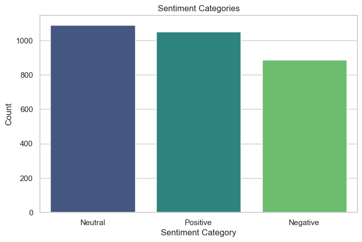

### Apple Sentiment Analysis Group 4 Project
 Collaboraters :

 -Luwate Inda

 -Cynthia Cheruto

 -James Ngumo

 -Batuli Abdullah
 
 -Peter

### Overview 
As a top-tier tech company, Apple boasts a robust portfolio from smartphones such as the iPhone, tablets like the iPad, laptops like the MacBook, and wearables like the Apple Watch. Its products elicit strong hunger among consumers and chatter on social media. Track Sentiment on Social Media To Help Address Customer Concerns Content With The Apple Experience Social media analysis helps companies comprehend the perception of their audience such that it is possible to offer insights for improvement of services or commodity. Sentiment Analysis of Apple on Social Media Overview: This project analyzes sentiment around Apple on social media, paying particular attention to popular topics, recurring issues, and methods to extract sentiment. This helps us to determine which analysis techniques work better, which product aspects are dominating the discussions and what are the stakeholders frustrations.

### Businnes Understanding
Objective
Apple's reputation and customer experience rely heavily on consumer sentiment. Analyzing customer feedback and product discussions can help Apple refine its strategies in product development, customer service, and marketing.

This project aims to:

-Assess overall sentiment toward Apple and its products on social media.

-Identify the most effective sentiment analysis methods for Apple-related discussions.

-Analyze key discussion topics, particularly by product category.

-Detect potential dissatisfaction through the use of curse words and other frustration indicators.

Relevance
By monitoring and analyzing sentiment trends, Apple can:

-Identify and respond to customer pain points.

-Understand the public reception of new products, such as the iPhone.
-Refine communication strategies to enhance customer trust and loyalty.
-Strengthen its brand reputation by proactively addressing stakeholder frustrations.

### Business Problem
Despite Apple's market leadership, social media analysis highlights areas for improvement in customer satisfaction and communication:

-Sentiment Analysis Accuracy: Various methods exist for sentiment analysis, but not all provide consistent results. Identifying the most reliable tool or combination is essential for actionable insights.

-Dominant Product Discussions: The iPhone is the most discussed product, but it's important to determine whether these discussions are mainly positive or mixed to gauge public reception.

-Frustration Indicators: The use of curse words in posts indicates frustration among some stakeholders, often related to software bugs, hardware defects, or poor customer service. Understanding these issues will help Apple implement targeted solutions.

### Data Cleaning and preprocessing
The dataset was sourced from data.world and contains comments from 
Twitter with the tag @Apple or the hashtag #AAPL

Most of the columns in the dataset are unnecessary as the labels provided were generated by a separate model, hence inapplicable to the work we are doing.
The cleaning involed removing unnecessary columns with missing values.

#### Preprocessing Data
This involved removal of stopwords, white spaces, URL, hashtags, mentions 
Upon cleaning the text duplicated tweets appear yet again.
These seem to be duplicated tweets that can be dropped as they do not represent a mass tweeting campaign.

This word cloud visually summarizes the most common words from tweets, offering insights into
What people are talking about most frequently when discussing Apple,
Themes or topics that are top-of-mind for users and 
Possible areas of focus for sentiment analysis or further investigation into user concerns and perceptions.

### Sentiment analysis
Sentiment analysis is a natural language processing (NLP) technique used to determine the emotional tone behind a series of words. This document demonstrates how to perform sentiment analysis on a set of tweets using NLTK's `SentimentIntensityAnalyzer`.

### Histogram combined with a kernel density estimate (KDE) plot & Bar chart

The histogram shows us the distribution of the sentiment of tweets. The sentiment generally leans positive and this is supported by the bar chart which shows positive sentiment having more tweets than negative.

However in the histogram, there is a noticeable spike in texts classified with a score of between 0.3 and 0.45. Inspecting a sample of scores in this range reveals that there has been some mis-calssification of text, which may skew the results.
We used TextBlob in the analysis and a k-means model with three clusters (positive, negative and neutral)

The combination of TextBlob and VADER seems to change the results significantly with a much bigger proportion of tweets beong interpretd as positive.

## Conclusions

The overall sentiment of apple leans positive. The most accurate sentiment analysis menthod is the combination of VADER and Blob. 

The most common topic seems to be the iPhone.

The frequent appearance of curse words suggests significant frustration among a group of stakeholders. This may be as individuals individuals tend to flock to twitter/X mainly when they face issues with the product

